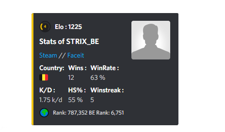
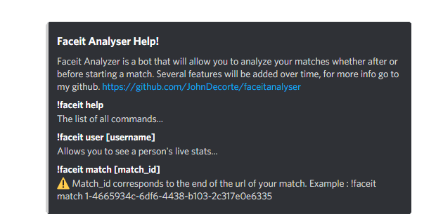

## Discord prompt
https://discord.com/api/oauth2/authorize?client_id=778403326354128916&permissions=0&scope=bot

## Table of contents
* [General info](#general-info)
* [Technologies](#technologies)
* [Commands](#commands)

## General info
Faceit Analyzer is a bot that will allow you to analyze your matches whether after or before starting a match. Several features will be added over time, for more info go to my github.
	
## Technologies
Project is created with:
* Discord.py
* Python 3.9
* Faceit API
* PyCharm 2020.2.3
	
## Commands
Here is the list of commands you can use with the bot:

```
!faceit help
The list of all commands...

!faceit user [username]
Allows you to see a person's live stats...

!faceit match [match_id]
Match_id corresponds to the end of the url of your match. Example : !faceit match 1-4665934c-6df6-4438-b103-2c317e0e6335
```



